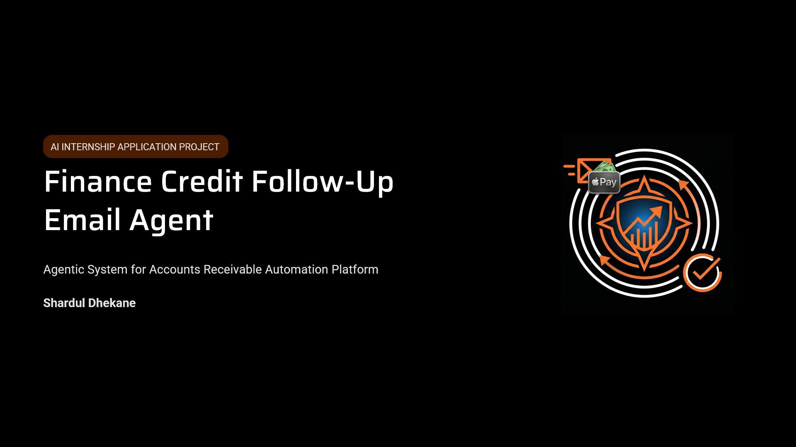
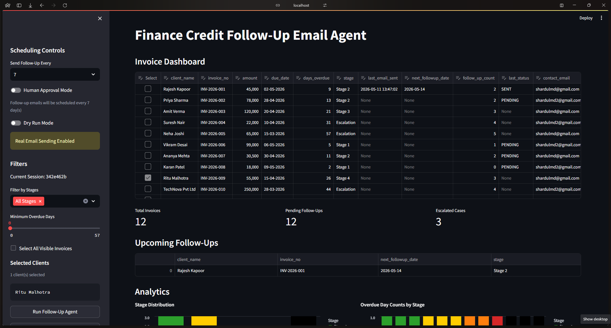
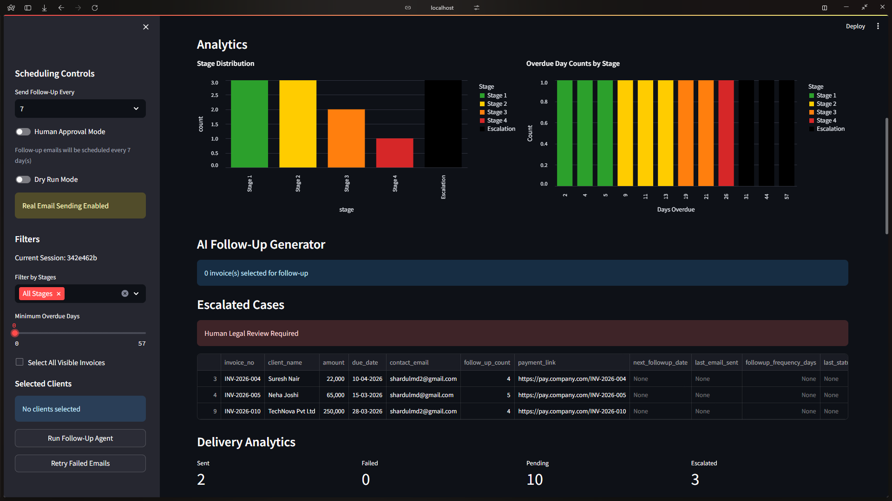
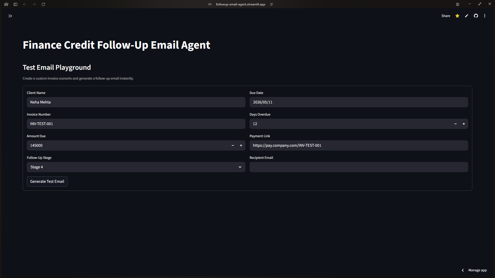

# Finance Credit Follow-Up Email Agent

Quick app for finance collections follow up workflows with scheduling, audit logs, approval gating, retry support, and Google SMTP mailing.



## 🎬 Demo & Video Showcase

**Live Demo:** [https://followup-email-agent.streamlit.app/](https://followup-email-agent.streamlit.app/)

**Video Walkthrough:** [Watch on YouTube](https://youtu.be/KMpTYcC4FhA?si=EWegnWNawA-9B1hN)

> For detailed insights on the development process, check out the **[Decision Log](DECISION_LOG.md)** and explore **Prompt Iteration** sections to understand how the AI email generation evolved through multiple testing cycles.

Read next: [Decision Log](DECISION_LOG.md) | [Prompt Iterations](PROMPT_ITERATIONS.md)

## Features

- Invoice dashboard with follow up selection
- Stage based filtering and analytics
- Human approval mode for send-or-review workflows
- SMTP email sending with dry run safety
- Retry failed emails
- SQLite backed audit trail and delivery status tracking

### Dashboard Gallery






## Requirements

- Python 3.12+
- `requirements.txt` dependencies installed
- Environment variables in a `.env` file for real email sending and LLM access:
	- `EMAIL_ADDRESS`
	- `EMAIL_PASSWORD`
	- `NVIDIA_API_KEY`
	- `LANGSMITH_API_KEY` (optional, enables tracing)
	- `LANGSMITH_TRACING=true` (optional, enables tracing)
	- `LANGSMITH_PROJECT` (optional project name)

## Local Setup

```bash
python -m venv .venv
.venv\Scripts\activate
pip install -r requirements.txt
streamlit run app.py
```

## Docker

Build the image:

```bash
docker build -t tci-followup-agent .
```

Run the container:

```bash
docker run --rm -p 8501:8501 --env-file .env tci-followup-agent
```

## Notes

- The app uses `logs.db` for invoice and audit persistence.
- If SMTP credentials are missing, dry-run mode will still work (Generates demo mail using AI/API).
- The model response parser is hardened for raw JSON with multiline email bodies.

---

Built by **[Shardul Dhekane](https://probablyspirit.dev)**

### 🔗 Connect & Follow

- **Portfolio:** [probablyspirit.dev](https://probablyspirit.dev)
- **GitHub:** [@ProbablyItsSpirit](https://github.com/ProbablyItsSpirit)
- **Kaggle:** [@sharduldhekane](https://www.kaggle.com/sharduldhekane)
- **Hugging Face:** [Spirit-26](https://huggingface.co/Spirit-26)

---
